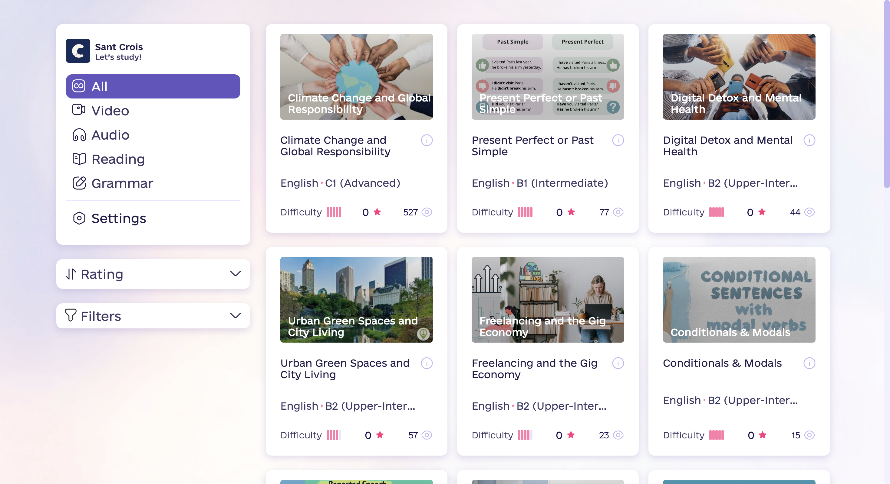
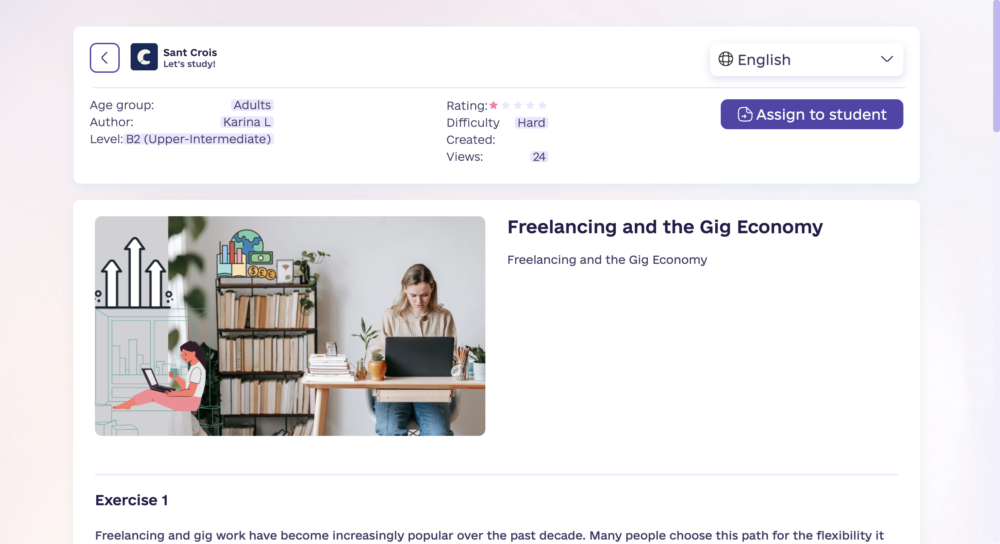
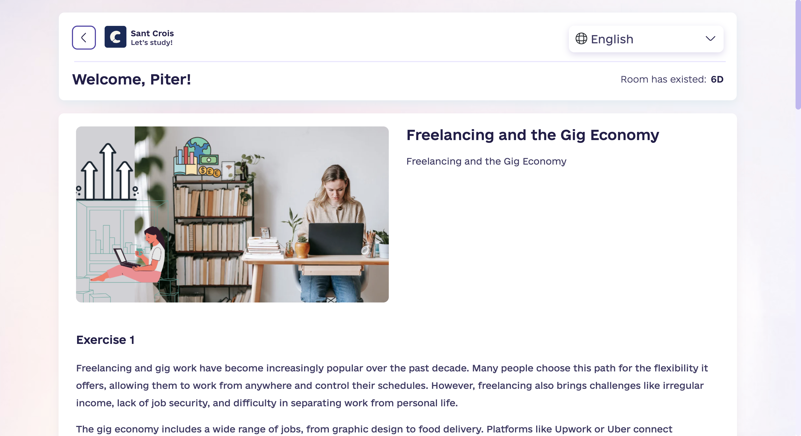
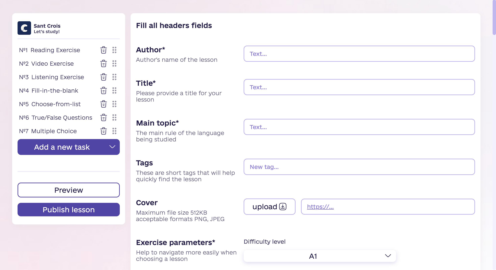

# Sant Crois

**Interactive language-learning platform built with Next.js, React and TypeScript.**

Sant Crois is a language-learning platform where teachers can create and assign interactive lessons, while students complete exercises with automatic answer checking and teacher review.

**Live demo:** https://sant-crois.fly.dev/

> This repository contains the frontend application. The backend was developed separately by a Java team.

---

## Overview

Sant Crois supports two main workflows:

- **Students** can discover and complete interactive language lessons.
- **Teachers** can assign lessons through private Virtual Rooms and review completed student answers.

Lessons are composed of reusable exercise types and can contain an arbitrary combination and number of exercises.

The public MVP launch reached **100 unique users within its first 24 hours**.

### Screenshots



_Show the main lesson discovery page with navigation, filters and lesson cards._

---

## My Role

I was the **sole frontend developer** in a cross-functional team consisting of three Java backend developers, a designer, a team lead/product owner and a content creator.

I built the frontend from scratch and was responsible for:

- frontend architecture and technology selection;
- application implementation and reusable UI components;
- REST API integration and API contract coordination;
- client-side state management;
- internationalization;
- Docker configuration;
- CI/CD with GitHub Actions;
- deployment to Vercel and later Fly.io;
- frontend development of the lesson constructor.

---

## Key Features

### Interactive Lesson System

The lesson engine supports seven exercise types:

- interactive text with tooltips;
- video with transcript and interactive text;
- audio with transcript and interactive text;
- multiple-choice questions;
- true/false questions;
- fill-in-the-blank exercises;
- fill-in-the-blank exercises with selectable answers.

Lessons can contain different exercise types in any combination and order.

After completing a lesson, students can review their answers with automatic correctness indicators and optional explanations.



_Show one of the most representative exercises, preferably interactive text, fill-in-the-blank, or another visually distinctive task._

### Lesson Discovery

The lesson library includes:

- pagination;
- sorting;
- filtering by lesson type;
- language;
- difficulty;
- primary and secondary topics;
- tags;
- age group.

### Virtual Rooms

Virtual Rooms allow teachers to create private lesson instances and share them with students through a dedicated URL.

The workflow:

1. A teacher selects a lesson and creates a Virtual Room.
2. The teacher receives a private URL to share with a student.
3. The student completes the assigned lesson.
4. Answers are automatically checked.
5. The teacher can open the same room and review the completed lesson in read-only mode.
6. The room expires after 7 days.



_Show the teacher's read-only review of a completed student's lesson, or the student experience inside a Virtual Room._

### Internationalization

The interface supports multiple languages with:

- `i18next`;
- `react-i18next`;
- locale-based routing for static pages;
- client-side language switching without a full page reload.

---

## Technical Architecture

The project uses the Next.js App Router with a modular frontend structure.

```text
src/
├── api/          # REST API integration
├── app/          # Next.js App Router
├── assets/       # Application assets
├── components/   # Reusable UI components
├── i18n/         # Internationalization configuration
├── locales/      # Translation resources
├── models/       # TypeScript models
├── store/        # Zustand stores
├── styles/       # Global styles
└── utils/        # Shared utilities
```

The application separates API communication, routing, reusable components, models, client-side state, localization and shared utilities.

### API Integration

Backend communication is handled through a dedicated API layer using Axios.

The API base URL is configured through the `NEXT_PUBLIC_API_BASE_URL` environment variable.

### State Management

Zustand is used for client-side application state, with state separated into dedicated stores.

### Next.js App Router

The application uses the App Router with dynamic locale-based routes and separate server/client boundaries where required by interactive functionality.

---

## Tech Stack

### Frontend

- Next.js 14
- React 18
- TypeScript
- Zustand
- Axios
- React Hook Form
- Zod
- i18next
- react-i18next
- CSS

### Infrastructure

- Docker
- GitHub Actions
- Fly.io
- Vercel

### Monitoring

- Microsoft Clarity

---

## Deployment

The application is containerized with Docker using a multi-stage build.

The production image uses:

- Node.js 22
- Next.js standalone output
- a dedicated non-root runtime user
- a separate production runtime stage

GitHub Actions is used to automate deployment to Fly.io.

The deployment flow is:

GitHub → GitHub Actions → Docker build → Fly.io

---

## Lesson Constructor

A separate `feature/constructor` branch contains frontend work for a lesson constructor.

The constructor was developed to make lesson creation more flexible and includes:

- drag-and-drop interactions;
- TipTap rich-text editing;
- interactive text exercises;
- fill-in-the-blank exercises;
- client-side persistence for editor-related data;
- migration of text exercise functionality from the previous custom parser approach.

The frontend implementation was completed, but corresponding backend changes were not completed after the backend team became inactive. The work therefore remains in the feature branch rather than being part of the current `main` deployment.

**Constructor branch:**  
https://github.com/Huzanand/sant-crois/tree/feature/constructor



_Show the TipTap editor and drag-and-drop lesson construction interface._

---

## Getting Started

### Prerequisites

- Node.js 22+
- npm

### Installation

    git clone https://github.com/Huzanand/sant-crois.git
    cd sant-crois
    npm install

### Environment Variables

Create a `.env.local` file:

    NEXT_PUBLIC_API_BASE_URL=http://localhost:8080

The application expects the backend API to be available at the configured URL.

### Development

    npm run dev

The application will be available at:

    http://localhost:3000

### Production Build

    npm run build
    npm start

---

## Project Status

The `main` branch contains the current frontend application together with its Docker and CI/CD configuration used for deployment.

The backend was developed separately and is not included in this repository.
